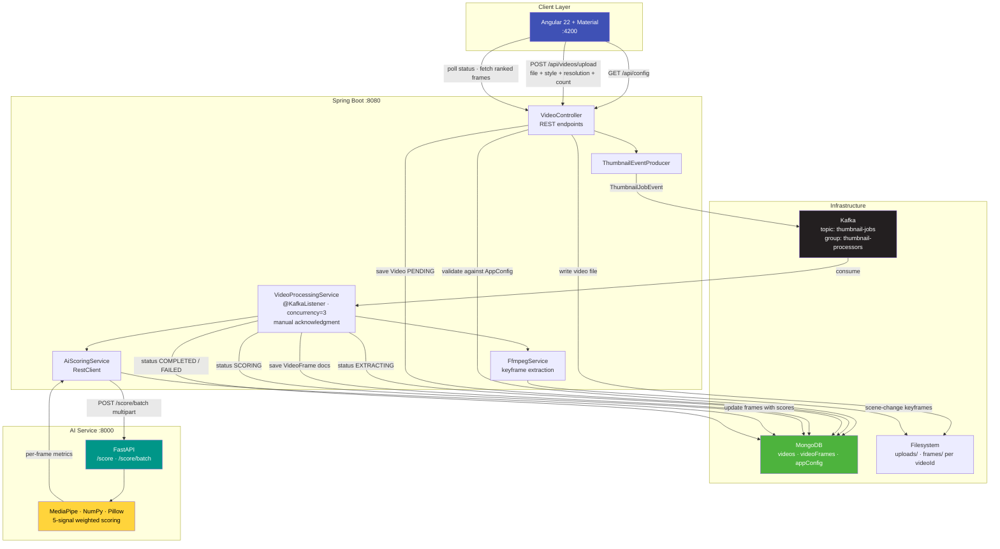
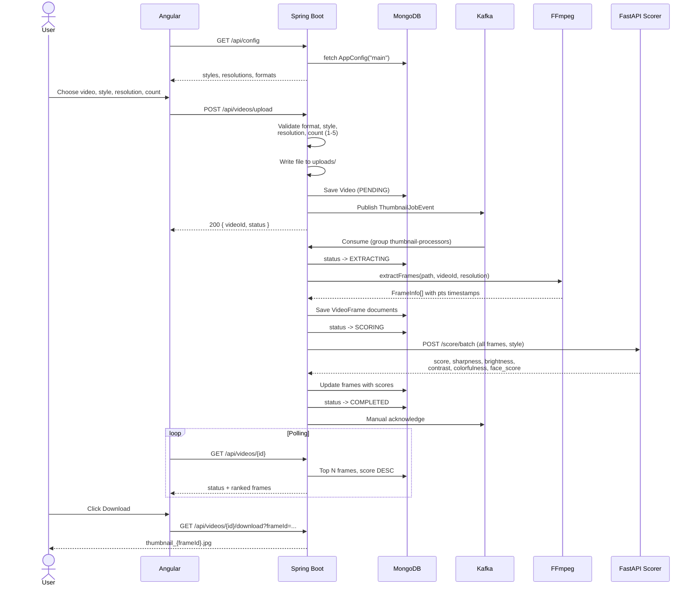
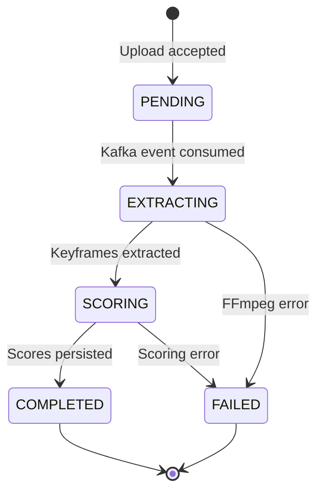

# AI Thumbnail Generator

Upload a video and get back the best thumbnail candidates, ranked automatically.

Instead of extracting frames at fixed intervals, this system uses FFmpeg scene-change detection to find visually distinct keyframes, then scores each one on five measurable quality signals and returns the top-ranked results.

## How It Works

1. The frontend loads supported styles, resolutions, and formats from `/api/config`.
2. A user uploads a video, choosing a style, output resolution, and how many thumbnails to return.
3. The backend validates the request, stores the file, saves a `Video` document as `PENDING`, and publishes a `ThumbnailJobEvent` to Kafka.
4. A Kafka consumer picks up the job, extracts keyframes with FFmpeg, and persists them.
5. Every frame is sent in a single batch to the FastAPI scoring service.
6. Scores are written back to MongoDB and the job is marked `COMPLETED`.
7. The frontend polls for status and renders the top-N frames sorted by score.

## Architecture



### Request Flow



### Job Lifecycle



## Tech Stack

| Layer | Technology |
|-------|-----------|
| Frontend | Angular 22, TypeScript, Angular Material |
| Backend | Java 21, Spring Boot 3.2, Spring Data MongoDB, Spring Kafka |
| AI Service | Python, FastAPI, MediaPipe, Pillow, NumPy |
| Video Processing | FFmpeg |
| Messaging | Apache Kafka |
| Database | MongoDB |
| Local Infra | Docker Compose |

## Screenshots

### Upload Form


### Style Selection


### Resolution Selection


### Results


## Keyframe Extraction

Rather than sampling at a fixed rate, FFmpeg is asked for frames that are either I-frames or represent a significant scene change:

```
-vf select='eq(pict_type,I)+gt(scene,0.3)',showinfo,scale=<width>:-1
-fps_mode vfr -q:v 2
```

`showinfo` output is parsed to recover each frame's `pts_time`, so every extracted frame keeps its real timestamp in the source video. Output width is derived from the requested resolution with height auto-scaled to preserve aspect ratio:

| Resolution | Width |
|-----------|-------|
| 360p | 640 |
| 480p | 854 |
| 720p | 1280 |
| 1080p | 1920 |

## Scoring

Each frame is evaluated on five signals, normalised to 0-100:

| Signal | Method |
|--------|--------|
| Sharpness | Variance of the gradient magnitude, to penalise motion blur |
| Brightness | Distance of mean luminance from mid-grey |
| Contrast | Standard deviation of the luminance channel |
| Colorfulness | Hasler-Süsstrunk style red-green / yellow-blue opponent metric |
| Face presence | MediaPipe face detection, weighted by bounding-box area and confidence |

### Style Presets

The final score is a weighted sum, and the weights change per style. `dark` and `bright` also invert or favour raw luminance rather than mid-grey balance.

| Style | Emphasis |
|-------|----------|
| `natural` | Balanced across all signals |
| `bright` | Favours high luminance |
| `dark` | Favours low luminance |
| `colorful` | Heavily weights colorfulness |
| `sharp` | Heavily weights sharpness |
| `face-focus` | Heavily weights face presence |

Weights live in `ai-service/main.py` and are straightforward to tune.

## Project Structure

```
thumbnail-generator/
├── ai-service/            # FastAPI scoring service
│   ├── main.py
│   └── requirements.txt
├── backend/               # Spring Boot backend
│   ├── pom.xml
│   └── src/main/java/com/thumbnailgen/
│       ├── config/        # Kafka, CORS, AppConfig seeding
│       ├── controllers/   # REST API + response DTOs
│       ├── entities/      # Video, VideoFrame, AppConfig, status enums
│       ├── events/        # ThumbnailJobEvent
│       ├── repositories/  # Spring Data Mongo repositories
│       └── services/      # FFmpeg, scoring client, Kafka producer/consumer
├── frontend/              # Angular frontend
├── screenshots/           # README images
├── docker-compose.yml     # Zookeeper, Kafka, Kafka UI
└── README.md
```

## Prerequisites

- Java 21+
- Maven 3.9+
- Node.js 20+ and npm
- Python 3.9+
- FFmpeg available on `PATH`
- Docker and Docker Compose
- MongoDB running on `localhost:27017`

Verify FFmpeg first, since extraction fails without it:

```bash
ffmpeg -version
```

## Getting Started

### 1. Start Kafka

```bash
docker compose up -d
```

This brings up Zookeeper, Kafka on `localhost:9092`, and Kafka UI on http://localhost:8090.

MongoDB is not yet part of the Compose file, so start it separately:

```bash
brew services start mongodb-community
```

### 2. Start the AI service

```bash
cd ai-service
python3 -m venv .venv
source .venv/bin/activate
pip install -r requirements.txt
python main.py
```

Runs on http://localhost:8000. Check it with `curl http://localhost:8000/health`.

### 3. Start the backend

```bash
cd backend
mvn spring-boot:run
```

Runs on http://localhost:8080. On first boot, `AppConfigSeeder` writes the default supported formats, styles, and resolutions into MongoDB.

### 4. Start the frontend

```bash
cd frontend
npm install
npm start
```

Runs on http://localhost:4200.

## API

### Backend (`:8080`)

| Method | Endpoint | Description |
|--------|----------|-------------|
| `GET` | `/api/config` | Supported formats, styles, and resolutions |
| `POST` | `/api/videos/upload` | Multipart upload: `file`, `style`, `resolution`, `count` |
| `GET` | `/api/videos/{id}` | Job status plus top-N frames ranked by score |
| `GET` | `/api/videos/{videoId}/frame/{frameId}` | Frame image as JPEG |
| `GET` | `/api/videos/{videoId}/download?frameId=` | Download a thumbnail as an attachment |

### AI Service (`:8000`)

| Method | Endpoint | Description |
|--------|----------|-------------|
| `GET` | `/health` | Health check |
| `POST` | `/score?style=` | Score a single image |
| `POST` | `/score/batch?style=` | Score multiple images in one request |

Example:

```bash
curl -X POST "http://localhost:8080/api/videos/upload" \
  -F "file=@sample.mp4" \
  -F "style=dark" \
  -F "resolution=480p" \
  -F "count=3"
```

## Configuration

### Backend

`backend/src/main/resources/application.yml`:

```yaml
spring:
  data:
    mongodb:
      uri: mongodb://localhost:27017/thumbnaildb
  kafka:
    bootstrap-servers: localhost:9092

app:
  upload-dir: /absolute/path/to/uploads
  frames-dir: /absolute/path/to/frames
  ai-service:
    url: http://localhost:8000
  topic: thumbnail-jobs
```

`upload-dir` and `frames-dir` are currently absolute paths and need to be changed for your machine.

Upload limits are set to 500MB for both multipart and Tomcat form POST size.

### Frontend

`frontend/src/app/core/environment/environment.ts`:

```ts
export const environment = {
  production: false,
  apiUrl: 'http://localhost:8080/api'
};
```

### Runtime options

Supported formats, styles, and resolutions are stored in the `appConfig` MongoDB document rather than hardcoded, so they can be changed without a redeploy. Defaults:

- **Formats:** mp4, mov, avi, mkv, webm
- **Styles:** natural, dark, bright, colorful, sharp, face-focus
- **Resolutions:** 360p, 480p, 720p, 1080p
- **Count:** 1 to 5 thumbnails per request

## Design Notes

**Kafka between upload and processing.** Frame extraction is a long, CPU-bound subprocess call, while scoring is a separate workload with different resource needs. Decoupling them through a topic keeps uploads responsive and lets each side scale independently.

**Manual acknowledgment.** Auto-commit is disabled and offsets are acknowledged only after a job reaches a terminal state, so a crash mid-processing does not silently drop the job.

**Consumer concurrency of 3.** Three listener threads process jobs in parallel from the `thumbnail-processors` group.

**Batch scoring.** All frames for a video are sent in a single multipart request rather than one call per frame, which avoids per-request overhead across the service boundary.

**Database-driven configuration.** The frontend fetches its dropdown options from the backend, so the UI, validation, and scoring service all agree on a single source of truth.

## Known Limitations

- `upload-dir` and `frames-dir` are absolute paths in `application.yml` and must be edited per machine.
- MongoDB is not included in `docker-compose.yml`.
- Scene-change detection can return a large number of frames for long or fast-cut videos, since extraction is not capped.
- Scoring uses hand-tuned weights over classical image metrics plus MediaPipe face detection; there is no learned ranking model.
- No automated tests yet.

## Roadmap

- [ ] Add MongoDB to `docker-compose.yml`
- [ ] Make upload and frame directories relative or container-friendly
- [ ] Cap the number of extracted frames for long videos
- [ ] Add CLIP embeddings for semantic relevance to the video's subject
- [ ] Replace polling with WebSocket or SSE status updates
- [ ] Add tests across backend, AI service, and frontend
- [ ] CI pipeline and containerise all three services

## License

Not yet licensed.
